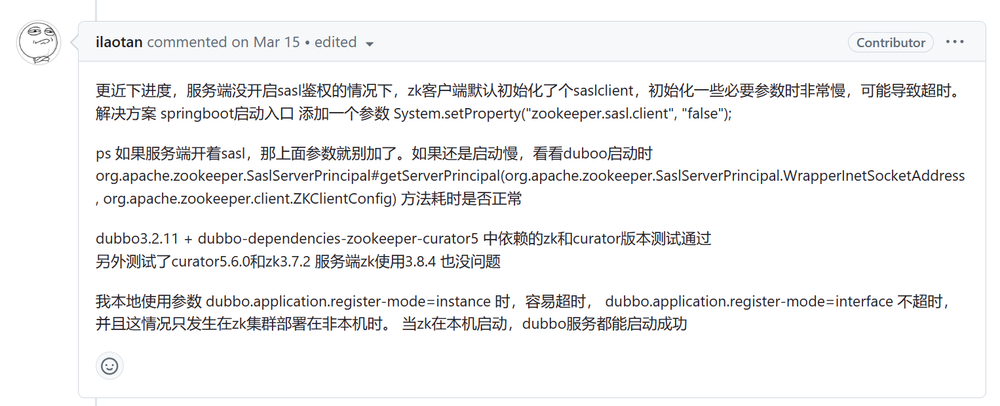

# Dubbo-Spring-Boot Demo

Dubbo结合SpringBoot开发

参考的是官方文档
[Dubbo+SpringBoot, 动手实践（从零代码开发版）](https://cn.dubbo.apache.org/zh-cn/overview/quickstart/java/spring-boot/#动手实践从零代码开发版)

和官方文档区别的地方是一些配置上有一定的区别，根据官方文档的配置，Provider和Consumer没办法启动，参考的是github这个链接某位老哥的回答：[Dubbo 3.2.2 无法连接zookeeper 3.8.1](https://github.com/apache/dubbo/issues/12552)


# Provider配置修改
对于Provider，我多配置了一个`register-mode: interface`选项，其实不是很懂具体的原因
```yaml
dubbo:
  application:
    name: dubbo-springboot-demo-provider
    register-mode: interface
  protocol:
    name: dubbo
    port: 28880
  registry:
    address: zookeeper://103.152.132.148:2181
```
# Consumer配置修改
对于Consumer，在主启动类多加了一行代码避免sasl鉴权: `System.setProperty("zookeeper.sasl.client", "false");`：
```java
package org.example;

import org.apache.dubbo.config.spring.context.annotation.EnableDubbo;
import org.springframework.boot.SpringApplication;
import org.springframework.boot.autoconfigure.SpringBootApplication;

@SpringBootApplication
@EnableDubbo
public class Main {
    public static void main(String[] args) {
        System.setProperty("zookeeper.sasl.client", "false");
        SpringApplication.run(Main.class, args);

    }
}
```